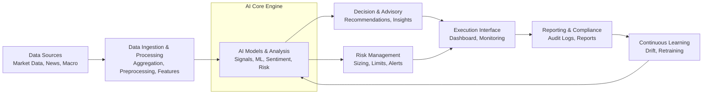

# AI Investment Assistant Workflow

```mermaid
flowchart LR
    A["Data Sources\nMarket Data, News, Macro"] --> B["Data Ingestion & Processing\nAggregation, Preprocessing, Features"]
    B --> C["AI Models & Analysis\nSignals, ML, Sentiment, Risk"]
    C --> D["Decision & Advisory\nRecommendations, Insights"]
    C --> E["Risk Management\nSizing, Limits, Alerts"]
    D --> F["Execution Interface\nDashboard, Monitoring"]
    E --> F
    F --> G["Reporting & Compliance\nAudit Logs, Reports"]
    G --> H["Continuous Learning\nDrift, Retraining"]
    H --> C

    subgraph Core["AI Core Engine"]
        C
    end
```
